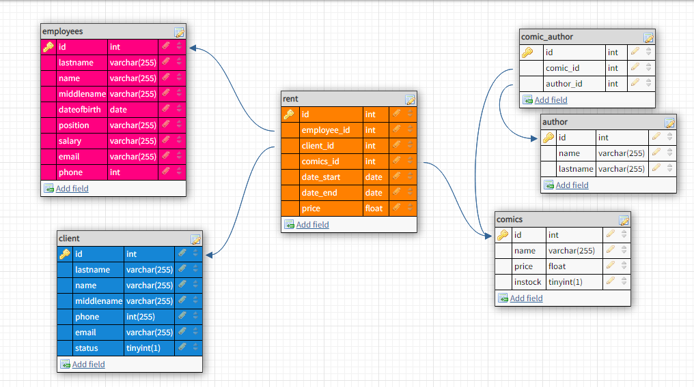

# DB-project "Магазин аренды комиксов"

## Таблицы:

- **client** 
- **comics**
- **author** 
  - **comic_author** вторичный ключи  *commic_id* и *author_id*   
- **empolyees**
- **rent** вторичные ключи *employee_id*, *client_id*  и *comics_id*

### Представления:

- **clients_who_didnt_return** посмотреть клиентов, которые не вернули комиксы, возвращает имя клиента, телефон клиента, почту клиента, назание комикса и дату конца аренды. Работает от *curdate()*.

- **comics_out_of_stock** посмотреть комиксы, которых нет в наличии. Возвращает название комикса и его статус (*instock*).

## data.sql 

Типовое заполнение таблиц:

- *line 1* client
- *line 9* comics
- *line 15* author
- *line 21* comic_author
- *line 27* employees
- *line 32* rent

## general.sql

Код разбит на блоки для легкого поиска.

- **block one**

Создание таблиц. Прим:

    CREATE TABLE `client` (
	  `id` int UNSIGNED  NOT NULL AUTO_INCREMENT,
	  `lastname` varchar(255) NOT NULL,
	  `name` varchar(255) NOT NULL,
	  `middlename` varchar(255),
	  `phone` int(255) NOT NULL,
	  `email` varchar(255),
	  PRIMARY KEY (`id`)
     );

- **block two**
Создание представлений. Прим:

        create view `clients_who_didnt_return` as
	        select concat_ws(' ', t.name, t.lastname) AS client_name, t.phone, t.email,   s.name as `comics`, r.date_end
	        from `client` AS t, `comics` as s, `rent` as r
	        where r.client_id = t.id and r.comics_id = s.id and CURDATE() > r.date_end 
	        order by r.date_end;
      
- **block three**      

Удаление

- **block four**

Просмотр содержания таблиц

- **block five**
  - *поиск* 
      - 107 client 
      - 113 comics
      - 119 comic author
      - 125 employees
      - 131-133 rent
  - *вставка* 
      - 108 client 
      - 114 comics
      - 120 comic author
      - 126 employees
      - 134 rent
  - *обновление*      
      - 109 client 
      - 115 comics
      - 121 comic author
      - 127 employees
      - 135 rent
  - *удаление*       
      - 110 client
      - 116 comics
      - 122 comic author
      - 128 employees
      - 136 rent
      
